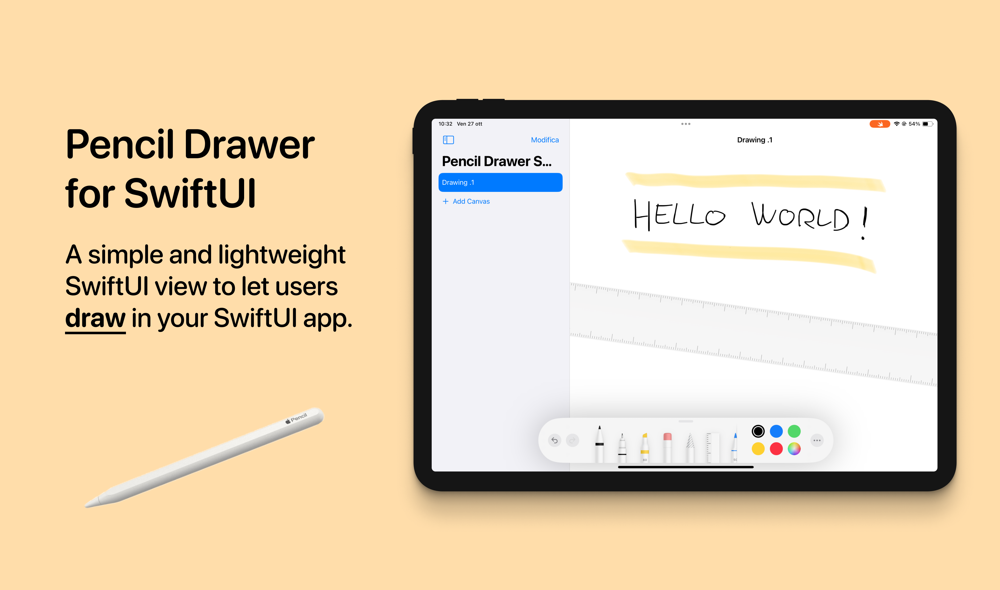

<div align="center">
  
  <h1><b>Pencil Drawer for SwiftUI</b></h1>
  <p>
    Pencil Drawer For SwiftUI is a Swift package that provides a SwiftUI view to let users draw in your SwiftUI app without going through the complicated PencilKit APIs and using the simple binding system of the SwiftUI framework.
    <br>
  </p>
</div>

<div align="center">
  <a href="https://swift.org">
<!--      -->
    
  </a>
  <a href="https://www.apple.com/ios/">
    
  </a>
  <a href="LICENSE">
    
  </a>
</div>

# Preview



## Usage

The `PencilKit` APIs store pencil drawings as plain binary data, represented in Swift by the `Data` type. All you need to do is to define a `Data` binded variable and pass it to the `DrawingView` view as it follows:

```swift
struct UsageExample: View {
    
    @State private var drawing: Data = Data()
    
    var body: some View {
        DrawingView(drawingData: $drawing, drawingPolicy: .anyInput, drawingChanged: { updatedData in
            // Handle changes in the drawing
            // ...
            
        })
    }
    
}
```

The changes to the data will be reflected in the canvas, and updates from the canvas will be synchronized with the data thanks to the SwiftUI binding system.

As you can see, you can also choose the drawing policy between:
- `default`: the default input type to use for drawing on a canvas.
- `anyInput`: allows drawing on the canvas from any input source.
- `pencilOnly`: pencil touches are the only input that draw on the canvas.


## Installation

Required:
- iOS 15.0 or above
- Xcode 13.0 or above

In Xcode go to `File -> Swift Packages -> Add Package Dependency` and paste in the repo's url: `https://github.com/alessiorubicini/PencilDrawerForSwiftUI`.
Then choose the main branch or the version you desire.


## License

Copyright 2023 (©) Alessio Rubicini.

The license for this repository is MIT License.

Please see the [LICENSE](LICENSE) file for full reference.
